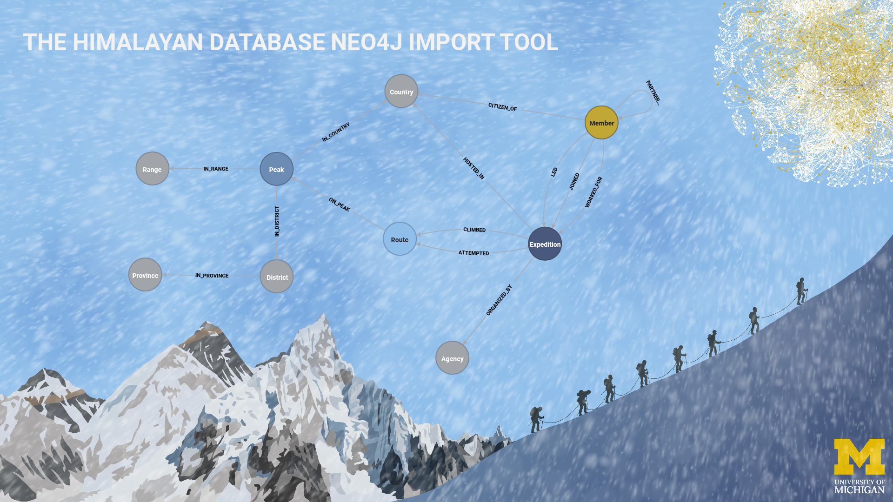

# Himalayan Database Neo4j Graph Database Import Tool
This is a tool to import the data from the [Himalayan Database](https://www.himalayandatabase.com/) into a Neo4j 
graph database.



## The Data
The data from the Himalayan Database are enhanced with data coming from the 
[Nepal Himal Peak Profile](https://nepalhimalpeakprofile.org/) website. This enhances the peaks data with information
like latitude and longitude of the peaks, permit fees, administrative districts and regions, etc.

For the description of the full graph data model, please refer to the dedicated documentation [here](docs/NEO4J_DATABASE.md)
## Tools Used in This Project
This project uses the following tools:
1. Anaconda to manage Python environment (Poetry can be used for that as described below)
2. Poetry to manage Python library packages and ensure reproducibility
3. DVC for the data pipeline
4. Neo4j Desktop to manage the Neo4j database

Note you must install both DVC and the Neo4j Desktop manually. DVC is not installed using Poetry in the environment due 
to errors when trying to do so. Please follow the [DVC installation instructions](https://dvc.org/doc/install/windows) 
to install it. Follow [the provided instructions](docs/NEOJ_SETUP.md) to install anc configure Neo4j Desktop.
## Getting Started
### 1. Clone the Repository and Download the Data
1. Clone the repository.
2. Download the database ZIP file from the Himalayan Database website. The data is available in the
[Download & Updates](https://www.himalayandatabase.com/downloads.html) section of the website.
3. Extract the data from the downloaded zip file and copy the `exped.*`, `members.*` and `peaks.*` files into the
`assets\data\hdb` folder.

Note that you do not need to install the Himalayan Database, just to download the database ZIP file.
### 2. Create the Python Environment
This repository uses [Poetry](https://python-poetry.org) to manage the Python dependencies and ensure that the correct 
versions are used. There are two ways to create a Python environment with the correct dependencies: 
* Using Anaconda to manage the Python environment and Poetry to manage the dependencies.
* Using Poetry for both the environment and the dependencies.

Once you have cloned the repository follow one of the two following methods to create the Python environment and
install the dependencies.
#### Using Anaconda and Poetry
In your command line, from the repository folder follow the steps below:
1. Create a new Anaconda environment with the following command (this will install Poetry within the environment):
```
conda create --name hdb-neo4j-import --file assets/conda/conda-win-64.lock
```
2. Activate the new environment:
```
conda activate hdb-neo4j-import
```
3. Use Poetry to install the dependencies:
```
poetry install
```
#### Using Poetry
To use Poetry for both the environment and the dependencies, you will need to install the proper version of Python and 
Poetry by yourself and instruct Poetry to use the correct Python version. When using Poetry to create a new environment,
it will automatically name the environment after the folder name. The virtual environment is created in the 
`{cache-dir}/virtualenvs`  or use the `{project-dir}/.venv` directory when one is available.

1. Install the latest version of Python 3.10 following the instructions on the 
[Python website](https://www.python.org/downloads/).
2. To install Poetry, follow the instructions on the [Poetry website](https://python-poetry.org/docs/#installation).
3. In your command line, from the repository folder, first disable any virtual environment:
```
poetry env use system
```
4. Use Poetry to create a new environment:
```
poetry env use /full/path/to/python
```
For example:
```
poetry env use D:\Python\Python310\python.exe
```
5. Use Poetry to install the dependencies:
```
poetry install
```
### 3. Install and Configure Neo4j Desktop
Please follow the detailed instruction in [this README file](docs/NEOJ_SETUP.md)
### 4. Run the DVC Pipeline
Please follow the [DVC installation instructions](https://dvc.org/doc/install/windows) to install DVC by yourself.
#### The DVC Pipeline DAG
The DVC Pipeline DAG performs the following actions:
1. pre-processes the peaks data coming from the  Nepal Himal Peak Profile website
2. pre-process the peaks, members and expeditions data coming from the Himalayan Database
3. merges the data from the two sources
4. imports the data into Neo4j

```
+-------------------------------+               +---------------------------------+               +-------------------------------+
| assets\data\hdb\exped.dbf.dvc |               | assets\data\hdb\members.dbf.dvc |             **| assets\data\hdb\peaks.dbf.dvc |
+-------------------------------+               +---------------------------------+*************  +-------------------------------+
                           *****                   *****             *************                                *
                                ***             ***    **************                                             *
                                   ***       **********                                                           *
                                  +-------------+                                                   +---------------------------+
                                  | etl-staging |                                                   | nepal-peaks-preprocessing |
                                  +-------------+**                                            *****+---------------------------+
                                                   *****                              *********
                                                        ***                    *******
                                                           ***            *****
                                                        +------------------+
                                                        | merge-processing |
                                                        +------------------+
                                                                  *
                                                                  *
                                                                  *
                                                          +--------------+
                                                          | neo4j-import |
                                                          +--------------+
```

Since the Nepal Himal Peak Profile has frequent issues, the pre-processing of the Nepal Himal Peak Profile data is done 
based on a CSV file containing the data already scraped from the website. Should you want to rerun the web scrapping 
prior to running the pipeline, you can do so by manually running the web scraper Python script from the Python 
environment:
```
python lib/data_collection/nhpp_collection.py
```
#### Running the Pipeline
With your Python environment activated, The Himalayan Database files extracted in the `assets\data\hdb` folder, the
Neo4j Desktop installed, configured and the DBMS running, run the DVC pipeline using the following command:
```
dvc repro
```
## How to use the tool?
## TO DOs
- [ ] Add pytest tests for the Nepal Himal Peak Profile website scraper script
- [ ] Add pytest tests for the data processing scripts