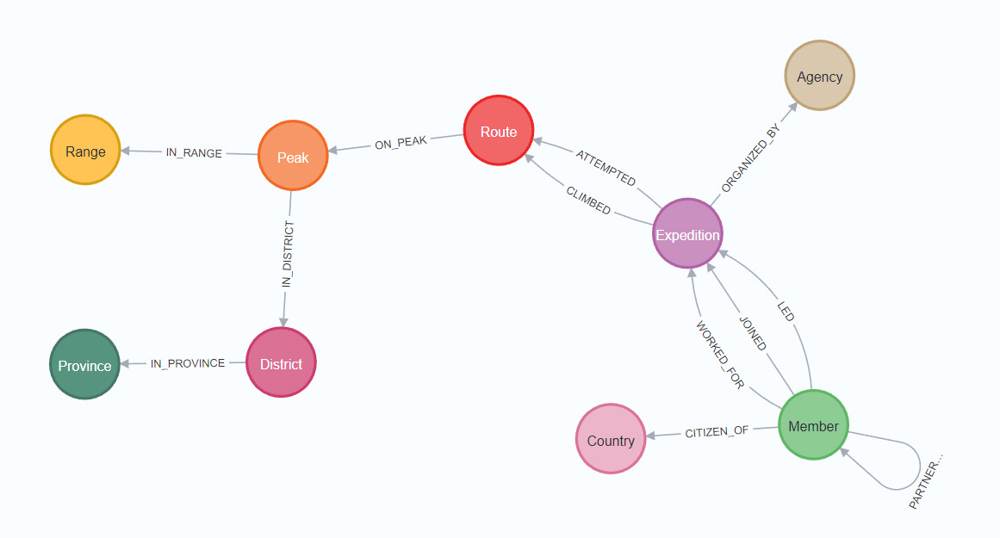
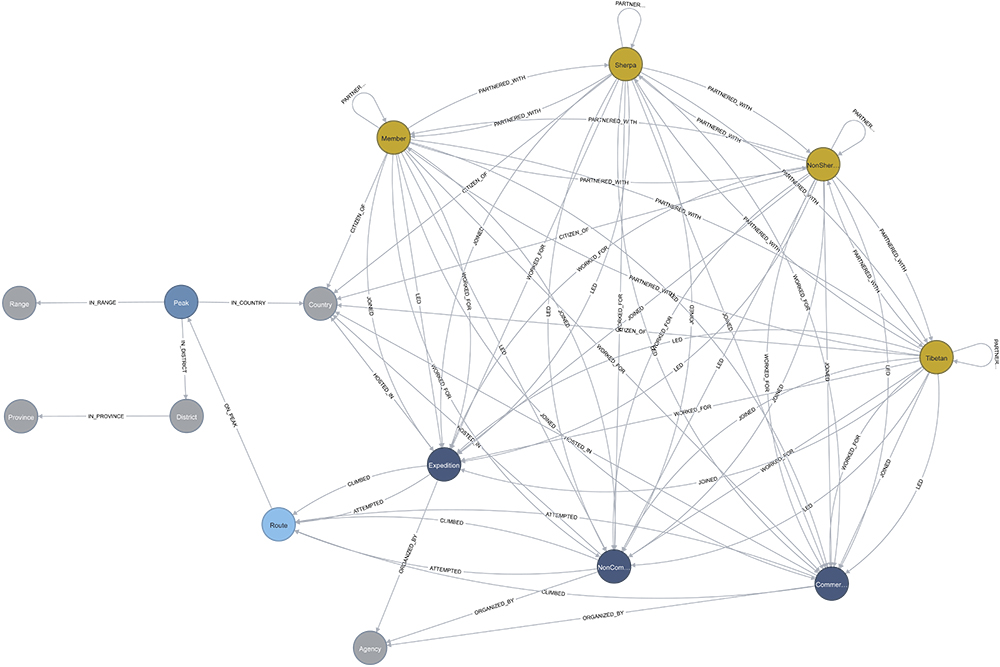
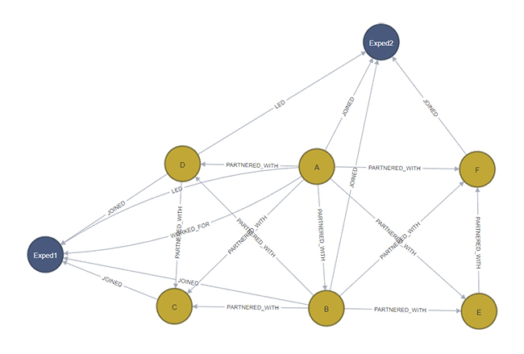

# Neo4j Database Graph Model
## Creation and Import
The Python script `lib\neo4j_import\neo4j_import.py` is used to create the Neo4j database and import the data. 

__IMPORTANT__:
* When run, the script creates or __recreates__ a Neo4j database called `himalayas`.
* The script can take a long time to run (20~60 minutes) depending on the hardware used.
## Data Sources
The data imported in the Neo4j database are the result of the execution of several ETL scripts on the source data
through our DVC pipeline to process the data and merge them in a consistent manner. The data sources are:
* The Nepal Peaks location data collected using the `lib\data_collection\nhpp_collection.py` containing data 
scrapped from the _[Nepal Himalaya Peak Profile](https://nepalhimalpeakprofile.org/)_, 
_[Peakvisor](https://peakvisor.com/panorama.html)_ and some manually collected missing data
* The Himalayan Database `expeditions`, `peaks` and `members` tables 
## Database Schema
The Neo4j database overall schema is defined as below:



Showing all node labels as different nodes but using the same color that they are different labels of the same node,
we get:



In this database we are using the Neo4j guidelines for naming:
* Node labels use CamelCase (e.g. `Expedition`)
* Relationships use uppercase with underscores (e.g. `HIRED`, `ON_PEAK`)
* Nodes and Relationship properties use camelCase (e.g. `expeditionId`)

For the full list of nodes and relationship properties, please [read this documentation](./SCHEMA.md).
## Graph Model Design Considerations
### Nodes vs Node Properties
There can be two ways of representing in a Graph database an information like the country of the expedition members:
1. Use a `country` property on the `Member` node
2. Create a `Country` node and link it to the `Member` node using a `CITIZEN_OF` relationship

The first approach has the drawback of duplicating the country information for each member, which, depending on the 
number of nodes, can significantly increase the size of the database. So it can be beneficial to represent such
data as a node instead of a node property.

On the other hand, the second approach has its own drawback. There is a huge cardinality difference between the number
of `Member` nodes and the number of `Country` nodes. When such a cardinality difference exists, it will create
super nodes in the graph, as thousands or more `Member` nodes will be linked to the same `Country` node. This creates
a performance issue when algorithm will traverse the graph ; potentially even preventing some algorithm to converge.

We have tried to find the most appropriate approach for each data. In the case of the `Country` node, we have decided
to use the second approach as the `Country` node is on the edge of the graph model (as can be seen above). So even if 
`Country` super nodes will be created, it should not have a significant impact on the performance of the graph 
algorithms.
### Multi-labels Nodes
Some nodes have multiple labels which are used to represent a node property instead of using an actual Neo4j node
property key-value field. For example, the `expeditions` table has a `COMRTE` (commercial route) column representing if
the expedition climbed a commercial route or not. This information can be represented in two ways:
1. as a boolean property `commercialRoute` of `Expedition` nodes
2. as a `CommercialExpedition` and a `NonCommercialExpedition` node labels

The advantage of the second approach is that it reduces the amount of duplicated data stored in each node and improves
the performance of the queries. For example, if we want to retrieve all the commercial expeditions, the first approach
leads to this query.
```cypher
MATCH (e:Expedition) WHERE e.commercialRoute RETURN e
```
This requires to load all expeditions first and then filter the expedition nodes where the `commercialRoute` property
is `true`. The second approach leads to this query:
```cypher
MATCH (e:CommercialExpedition) RETURN e
```
This query is much more efficient as it only loads the expedition nodes with the `CommercialExpedition` label.

Note that multiple labels do not create multiple nodes. In the `Expedition` node example, the `CommercialExpedition` 
and `NonCommercialExpedition` labels are just additional labels added to existing `Expedition` node. 

Neo4j recommends that nodes should not have more than 4 labels. We use this approach only for properties which
are important in our analysis and will often be queried.
## Nodes
### The Name Property
All nodes are given a `name` property which is used to display or easily identify the nodes by their names instead of
their ID. For some nodes (e.g. `Members`), the `name` property is a concatenation of existing node properties. This
duplicates data and increases the size of the database, but having a common `name` property to represent all nodes
allows for downstream code simplification and also makes it easier for data visualization. 

Also note that for some nodes (e.g. `Members`), there is not guarantee that the `name` property is unique. Refer to
each node section below for more details on their unique identifier.
### Expeditions
The `Expedition` is unfortunately __not__ uniquely identified by the id column `EXPID` of the `expeditions` table. 
There are for example two expeditions `EVER21101`, one in 1921 and one in 2021. We thus uniquely identify expeditions 
using a combination of the `EXPID` and the `YEAR` columns, which are set as the `name` property of the node.

The name property is a concatenation of the `EXPID` and the `YEAR` .
### Peaks, Ranges, Provinces and Agencies
These nodes are uniquely identified by their `name` property.
### Districts and Countries
These nodes are uniquely identified by their `name` property. Some members have two nationalities 
(e.g. `France/Algeria`) and some peaks are at the borders of two districts (e.g. `Humla/NC`). In these cases we create 
two nodes and a relationship to each of them.

Districts labeled as "NC" (China) and "NI" (India) are ignored as they are not Nepal districts. A peak with a district
set to `Humla/NC` will thus end up having only one relationship to the `District` node with the name `Humla`.

The `expeditions` table has a `HOST` column describing the country *hosting* the expedition. This information is 
transformed as a `HOSTED_IN` relationship between the `Expedition` node and the `Country` node.
### Routes
Although expeditions climb a peak, to be more precise, they climb a specific route on a peak. And this information is
important since routes can be very different in terms of difficulty and exposure. However, the *East Face* of *peak A*,
is different from the *East Face* of *peak B* and should be 2 different nodes. Thus, the `Route` node `name` property is
set as a concatenation of the route name followed by the peak ID in parentheses, and is uniquely identifying a route.

Route names from the Himalayan Database have been cleanup. Many route names contain mentions like "(to 6000m)", 
"for (acclim)", _via_ or _from_ information like "SE Ridge via White Peak". All those additional information in route 
names artificially inflate the number of `Route` nodes connected to a `Peak` node. We have tried to clean up as much as 
possible these route names. Some routes also have up and down routes information like "W Pillar up; NW Ridge down". For
those, we took the arbitrary decision to only keep the ascent route since it is the main focus in mountaineering.
### Members
The Himalayan Database `members` table id column `MEMID` is not a unique identifier of a person, but an identifier of a 
person in the expedition. The `members` table has thus no unique identifier of people. Our ETL DVC pipeline uses the 
combination of `FNAME`, `LNAME`, `SEX` and `YOB` to uniquely identify people and use a hash function to generate a
unique `PERSID` identifier for each person. This `PERSID` is used as the unique `personId` key of the `Member` node.
For `Sherpa`, as most of them share the same last name, using a combination of `FNAME`, `LNAME`, `SEX` and `YOB` is not
enough to uniquely identify them. Refer to the below section [Dealing with Non-Unique Sherpas](#dealing-with-non-unique-sherpas)
for more details about this problem. For them, we also added the `RESIDENCE` column to the unique identifier. We 
acknowledge that a person might change residence from one expedition to the other, which would lead to the creation of 
two different`Member` nodes for the same person. However, based on our exploration of the data, we believe that this is 
a rare case and that this approach will help to better uniquely identify `Sherpa`, more than it will create duplicates.

The `name` property is a concatenation of the last name and first name.

Most of the columns in the `members` table are not a property of the individual but a property of the expedition. For 
example the `MPERHIGHPT` (the personal high point), or the `MO2USED` (the oxygen used) columns. As a result only the
columns being a property of the individual are imported as node properties. This includes the *firstname*, *lastname*,
*gender*, *year of birth*, *occupation* and *residence*. All other columns are imported as properties of the 
`LED`, `JOINED` or `WORKED_FOR` relationships to the expedition. We acknowledged that an individual might change 
residence and occupation from one expedition to the other. However, it is a property of the individual and not of the 
expedition. The latest non-empty values in the `members` table are the ones set to the `Member` node properties.
#### Expeditions, CommercialExpeditions and NonCommercialExpeditions
As mentioned above, the `expeditions` table has a `COMRTE` (commercial route) column representing if the expedition
climbed a commercial route or not. An expedition can climb up to 4 routes. For expeditions climbing multiple routes, 
the `COMRTE` column gives no indication of which of the route climbed/attempted was a commercial one. It only helps to 
classify an expedition as a commercial expedition in case it climbed at least one commercial route. There is however 
an exception in the case of an expedition which main objective was a non-commercial route and who has climbing a 
commercial route (often just partly) as an acclimatization climb. In this case, the `COMRTE` column is set to `false` 
in the Himalayan Database and the expedition is considered as a non-commercial expedition.

This information is represented in the database as a `CommercialExpedition` and a `NonCommercialExpedition` node labels. 
This does not create an `Expedition` and a `CommercialExpedition` node for an expedition on a commercial route. It just 
creates one node with two labels.

In the `expeditions` table, some expeditions have no `COMRTE` value. We make the following modifications:
1. Commercial expeditions are considered to have started in 1988. So any expeditions before 1988 is also given the 
`NonCommercialExpedition` label regardless of the `COMRTE` value (some pre-1988 expeditions do have a `COMRTE` value 
set to `true` in the Himalayan Database). 
2. From 1988 nodes without a `COMRTE` and are __not__ on a peak known to have scommercial route is also given the
`NonCommercialExpedition` label (see the list below).
3. From 1988 nodes without a `COMRTE` value and are on a peak known to have a commercial route just have the 
`Expedition` label. No additional `CommercialExpedition` or `NonCommercialExpedition` label is added.

List of peaks known to have a commercial route:
* AMAD - Ama Dablam
* ANN4 - Annapurna IV
* BARU - Baruntse
* CHOY - Cho Oyu
* EVER - Everest
* HIML - Himlung Himal
* MANA - Manaslu
* PUMO - Pumori
* PUTH - Putha Hiunchuli
* TILI - Tilicho Peak
#### Members, Sherpas and Tibetans
Members of an expedition are all represented by `Member` nodes. However, members who have the `SHERPA` column set to
`true` are also assigned the `Sherpa` node label. Similarly, members who have the `TIBETAN` column set to `true` are 
also assigned the `Tibetan` node label. Finally, members who have neither the `SHERPA` nor the `TIBETAN` column set to
`true` are assigned a `NonSherpaNonTibetan` label. Such nodes could be identified by matching nodes with the `Member`
label but without the `Sherpa` or `Tibetan` label. However, we think that looking for such nodes will be a frequent
enough operation that it is worth having a dedicated label for it to improve performances of such queries.
These labels allow us to more efficiently query the database when inquiring about these specific groups, since the 
database will directly retrieve a subset of the members.
## Relationships
### Directed vs Undirected Relationships
In Neo4j, relationships *must* be directed. For undirected relationships, it is best practice to defined them as 
directed but query them as undirected, instead of creating 2 directed relationships. We are following this 
recommendation. This implies the following:
* Most of the nodes' relationship directions do carry a meaning. For example:
  * A member joined an expedition `(:Member)-[:JOINED]->(:Expedition) `
  * A route is on a peak `(:Route)-[:IS_ON]->(:Peak)`
  * A member is a citizen of a country `(:Member)-[:CITIZEN_OF]->(:Country)`
* The `Members` `PARTNERED_WITH` relationship, although directed, does not carry a meaning. It is just a way to
represent that two persons are members of the same expedition. This relationship should be queried as undirected.

When using the Graph Data Science plugin and projecting the database into a graph, the graph should be projected as
undirected to avoid the graph algorithms to consider the relationship direction.
### Expeditions and Peaks Relationships
An expedition which succeeded, has a `CLIMBED` relationship to the route it climbed. An expedition which failed has
an `ATTEMPTED` relationship to the route.

We understand that `ATTEMPTED` name can be misleading since an expedition with a very hard route objective can on 
purpose first do only part of a simpler route for acclimatization. In that case the expedition might have had no 
objective to reach the summit. However, we have no way to know if this is the case or not. We follow here the same 
logic as the `SUCCESS1` to `SUCCESS4` columns in the Himalayan Database which categorize a route as successful or not 
purely on the basis of the summit being reached or not, whether that was the objective or not. As a result all routes 
with the corresponding `SUCCESS` column set to `false` are considered as `ATTEMPTED` routes.

Multiple routes/peaks can be attempted or climbed by a single expedition. Based on the `expedition` table columns 
`ROUTE1` to `ROUTE4` and `SUCCESS1` to `SUCCESS4`, we can have a combination of up to 4 `CLIMBED` or `ATTEMPTED` 
relationships from a single expedition. For such a relationship to be created both the `ROUTE` and `SUCCESS` columns 
must be filled in. If only one of the two is filled in, the relationship is not created.
### Members and Expeditions Relationships
There are 3 types of relationships between members and expeditions:
* A member with the `LEADER` column set to `true` has a `LED` relationship with the expedition.
* A member with the `HIRED` column set to `true` has a `WORKED_FOR` relationship with the expedition.
* A member with the `LEADER` column set to `false` and the `HIRED` column set to `false` has a `JOINED` relationship
with the expedition.

Note that a member can be both a leader and be hired by an expedition. In this case, the member will have both the
`LED` and `WORKED_FOR` relationships with the expedition (there are few such cases in the database).
### Expedition Members' Relationships
All members of the expedition have a `PARTNERED_WITH` relationship with each other since they all participated in the 
same expedition. This creates a fully meshed graph of all expedition members. When the same persons are members of 
multiple expeditions, they just have a single `PARTNERED_WITH` relationship with each other. We do not create a 
relationship between two members per expedition they participated in. 

However, the `PARTNERED_WITH` relationship has a `expeditionCount` property which represents the number of expeditions 
the two members participated in together. This can be used as a proxy to evaluate the strength of the relationship 
between two members.

Taking an example of two expeditions with 4 members each (*A*, *B*, *C* and *D*) in the first expedition and (*A*, *B*, 
*E* and *F*) in the second expedition, the `PARTNERED_WITH` relationships will between nodes *A* and *B* will have an
`expeditionCount` of 2. The `PARTNERED_WITH` relationships between all other nodes will have an `expeditionCount` of 1.


## Dealing with Non-Unique Sherpas
A difficulty with the Himalayan Database is to uniquely identify people, especially Sherpas. Using firstnames, 
lastnames, gender and year of birth is unfortunately not enough to uniquely identify Sherpas, since the probability to
have two Sherpas with the same firstname and year of birth is very high. On top of that the year of birth is often
missing for Sherpas.

We tried to estimate the magnitude of this problem by estimating, after uniquely identifying members in our ETL pipeline
following the above logic, the percentage of Sherpas in the database who are different individuals identified as one.
To do so we used 3 different proxy metrics:
1. The total number of expeditions joined and the number of expeditions joined in one season. As a climbing season is 
about 3 months long and one expedition is in average 22 days long, any Sherpa who participated in more than 3 
expeditions in one season would be suspicious.
2. The total number of years climbing between their first and last expedition. Such a metric shows Sherpas climbing for
more than 80 years and up to 100 years which is clearly impossible.
3. Sherpas participating in overlapping expeditions. Since we have the dates an expedition arrived in base camp and the
date it terminated we can track if a Sherpa with a unique identification number is reported in two different expeditions 
at the same time. For this measure we ignore the case when a Sherpa is reported in two expeditions in Everest and Lhotse 
and starting and ending at the same time. As both peaks are very close to each other and their standard routes are
approached from the same base camp, it is common for a team to climb both peaks during their stay in Nepal. But this is 
reported as 2 different expeditions in the database. This is thus a valid case of a person participating to two
expeditions at the same time and ignore it.

None of those metrics are perfect, and they all fail to capture the case of two different Sherpas identified as one,
participating to different expeditions one season to few years apart. But they are the best we can do considering the
data we have.

Our worst and most accurate estimation of the problem is provided by the third metric which shows 8% of the Sherpa
population miss identified as one, which is less than 1% of the total population.
## Dealing with NaNs
Data represented in a table format have all properties (columns) defined in the table, restricting the possible
properties data points must have. Data points without a value for a property are represented by a `NaN` values. This 
does not apply to Neo4j nodes and relationships. A node or relationship must have all its properties defined. If a node 
or relationship does not have a value, it simply doesn't have that property. As a result Neo4j doesn't handle `NaN` 
values (except for `float` since version 5.0). 

Thus, we need to deal with `NaN` values in the imported tables from the Himalayan Database and the peaks' location data 
collected from the web. We do this by converting any row containing a `NaN` value to a row of type `string` with an
empty string as the value. When importing the data, if a data has a column value equal to an empty string, we set the 
property of the corresponding node or relationship to `null` (i.e. we do not set the property for that node or 
relationship).

Read this Neo4j knowledge base article for more information: 
[Understanding non-existent properties and working with nulls](https://neo4j.com/developer/kb/understanding-non-existent-properties-and-null-values/)
## Testing the Graph Database Schema with Pytest
The import tests are located in the `test` directory. They are written in Python using the `pytest` framework.

The tests, create a temporary Neo4j `himalayastest` database  on the Neo4j server and import test data related to the 
first 100 expeditions together with some known expeditions susceptible to create problems in the schema. It then 
performs a series of tests to verify that the database schema is correct. This helps, when making changes to the 
Cypher queries or import Python script, with making sure that the changes do not break the database schema. Once the 
tests are completed the temporary database is deleted from the server.

Are tested:
* All expeditions should have at least one member
* For every expedition, the subgraph of all the members of that expedition should be a fully meshed graph (see above)
 the [Expedition Members' Relationships](#expedition-members-relationships) section for more details.
* There should be only one relationship of any `LED`, `JOINED`, `WORKED_FOR` type between a member and an expedition.
E.g. a member can have a `LED` and `WORKED_FOR` relationship with an expedition but not two `LED` relationships to
the same expedition. 
* There should be no countries with a "/" in their name. Members who have multi-nationality should have a relationship
to each country they are a citizen of.
* There should be no district with a "/" in their name. Peaks which are at the border of two districts should have a
relationship to each district they are in.
* All peaks should have a name
* Every peak should be in at least and at most 1 mountain range
* There should be no "NC" (China) or "NI" (India) districts.
* Every district expressed as the combination of 2 (e.g. "Darchula/Bajhang") should have been split into 2 districts
* Every district should be in at least and at most 1 province

To run the tests with the details of the actions performed during the test, run the following command from the root
folder
```bash
python -m pytest lib\neo4j_import\ -sv
```
## Changes to the Himalayan Database
### Data Added to the Himalayan Database
From the Nepal Himalaya Peak Profile website we collected the following additional peak data:
* An additional ~50 peaks not in the Himalayan Database
* latitude
* longitude
* range
* district
* province
* fees for Nepalese
* fees for foreigners
### Members Discarded from the Himalayan Database
All members with no last name or `Unknown` lastname and no firstname or a number as firstname have been discarded.

If within an expedition there are two Sherpas in the Himalayan Database which we identified with the same ID (they have 
the same firstname, lastname, gender, year of birth and address), only the first one is kept.
### Fields Discarded from the Himalayan Database
For the full list of nodes and relationship properties, please [read this documentation](./SCHEMA.md).
The following columns from the Himalayan Database tables have not been imported into the Neo4j database:
* The entire `reference` table
* From the `expeditions` table:
  * `HOST` - This information is represented as a `HOSTED_IN` relationship to `Country` nodes.
  * `LEADERS` - This information is taken from the `members` table and represented as a relationship.
  * `NATION` - This information is taken from the `members` table and represented as a node.
  * `PRIMRTE` - Route info with primary expedition.
  * `PRIMMEM` - Member info with primary expedition.
  * `PRIMREF` - Literature info with primary expedition.
  * `PRIMEXPID` - Primary expedition ID.
  * `CHKSUM` - Internal consistency check.
* From the `members` table:
  * `MYEAR` - The information is contained in the Expedition node.
  * `MSEASON` - The information is contained in the Expedition node.
  * `AGE` - The age of the member at the time of the expedition. This column is empty in the public version of the
  Himalayan Database.
  * `BIRTHDATE` - The birthdate of the member. The column is empty in the public version of the Himalayan Database.
  * `MSMTDATE2`, `MSMTDATE3` - The date that the member summited the peak the second/third time on this same expedition. 
  A second or third ascent is counted only if the climber descended all the way to base camp or advanced base before 
  re-ascending to the summit.
  * `MSMTTIME2`, `MSMTTIME3` - The time that the member summited the peak the second/third time on this same expedition.
  * `MROUTE1`, `MROUTE2`, `MROUTE3` - First second and third ascent route. This is a number with no clear information
    about what it represents.
  * `MASCENT1`, `MASCENT2`, `MASCENT3` - The team ascent number for this summit. This information is irrelevant for 
  our analysis.
  * `HCN` - Himalayan Club number
  * `CHKSUM` - Internal consistency check
  * `MSMTNOTE1` - Summit notes for the first ascent.
  * `MSMTNOTE2` - Summit notes for the second ascent.
  * `MSMTNOTE3` - Summit notes for the third ascent.
  * `DEATHRTE` - The route number in use by the deceased climber.
* From the `peaks` table:
  * `LOCATION` - This information is represented by the relationship to `Range` nodes and the data now include 
  `latitude` and `longitude` attributes gathered from the Nepal Himal Peak Profile website. 
  * `HIMAL` - We do not import this column but instead use the `RANGE` column collected from the Nepal Himalaya Peak
    Profile website.
  * `REGION` - We do not import this column but instead use the `DISTRICT` and `PROVINCE` columns collected from the
    Nepal Himalaya Peak Profile website.
  * `PHOST` - This information is represented by the relationship to `Country` nodes.
  * `PYEAR` - The year of the peak first ascent. This information can be found querying the database.
  * `PSEASON` - The season of the peak first ascent. This information can be found querying the database.
  * `PEXPID` - The expedition id of the peak first ascent. This information can be found querying the database.
  * `PSMTDATE` - The date of the peak first ascent. This information can be found querying the database.
  * `PCOUNTRY` - The country of the expedition who has done the first ascent. This information can be found querying 
    the database.
  * `PSUMMITERS` - The people who did the peak first ascent. This information can be found querying the database.
  * `PSMTNOTE` - Note about the first ascent. This information can be found querying the database.
  * `REFERMEMO` - The `reference` table is not imported.
  * `PHOTO` - The photo is not imported.