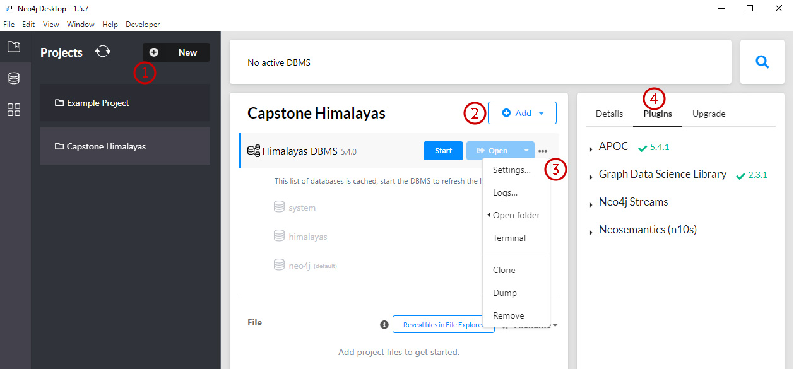
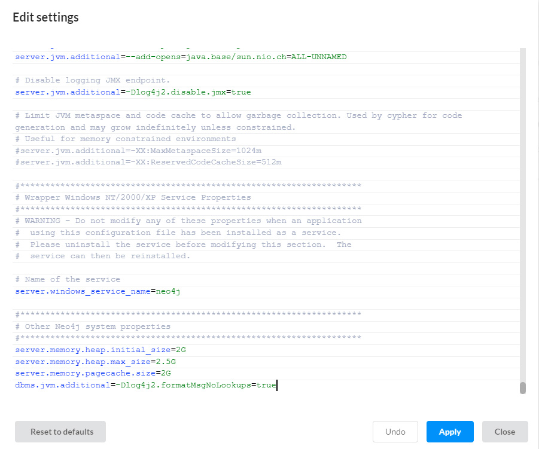
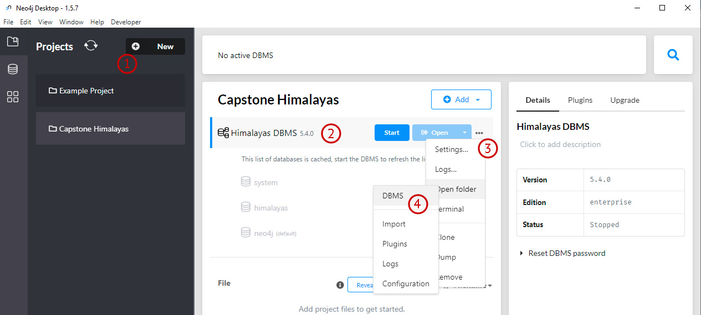

# Neo4j Setup
This project uses a local instance of a Neo4j database.

## Getting started
You need to follow all the instructions below to be able to run the project and reproduce the results.
1. Download and install Neo4j desktop
2. Install the Neo4j  `APOC` and `Graph Data Science Library` plugins
2. Follow all the [configuration](#configuration) steps below
3. [Import the Himalayan Database into Neo4j](#import-the-himalayan-database-into-neo4j)
4. [Copy the Pre-Computed Graph Data](#copy-the-pre-computed-graph-data)
## Versions
This project uses:
* `Neo4j Desktop` 1.5.7
* `Neo4j DBMS` in version 5.4.0 
* `APOC` Plugin in version 5.4.1
* `Graph Data Science Library` Plugin in version 2.3.1
## Download and Installation
Download the Neo4j Desktop application from [here](https://neo4j.com/download-neo4j-now/). You will need to register
with your email address and create a password (note the password down, you will need it later). Once you have done this 
you can download the application and you will receive a software key. You will need this key to activate the application
following the instructions 
[here](https://neo4j.com/developer/kb/how-to-use-activation-keys/).
## Configuration
### Neo4j Desktop Setup
Once you have installed the Neo4j Desktop application, you will need to create a new local DBMS instance and 
install the aforementioned plugins. You can follow the instructions in the following screenshot:
1. Create a new Project
2. Add a new local Neo4j DBMS instance to your project
3. Update the DBMS memory configuration as described below (you might have to come back and adjust these settings later
depending on your environment, if you run into memory issues). See the 
[Neo4j Memory Configuration](#neo4j-memory-configuration) section below for more details.
4. Install the `APOC` and `Graph Data Science Library` plugins
5. Set version to 5.4.0 (desktop installs as 5.3.0)


### Neo4j Memory Configuration
Importing the entire dataset and running the graph algorithms requires a lot of memory. In our environment, we had to configure the Neo4j DBMS as
follows to avoid memory issues:
```bash
dbms.memory.heap.initial_size=2.5G
dbms.memory.heap.max_size=4G
dbms.memory.pagecache.size=2.5G
```
To update the memory configuration in the Neo4j desktop, 
1. Open you project 
2. Select your DBMS instance 
3. Click on the [...] button, right of the `Start` and `Open` buttons and click on `Settings...` (see point (3) on the screenshot above)
4. Scroll down to the bottom of the file and edit the memory settings as described above
5. And click on the `Apply` button. If your DBMS instance is running, you will need to restart it.



### Neo4j Plugins: APOC and Graph Data Science Library
1. Click on Graph DBMS 
2. Select "Plugins" from right side menu
3. Choose plugins and select "Install"

### Neo4j APOC Plugin Configuration
#### Enabling Procedures
After installing the `APOC` and `Graph Data Science Library` plugins, makes sure the plugins procedures are authorized. 
To do so go back in the DMS settings (see above), starting from the bottom of the configuration, scroll back up and 
look for the below setting and make sure it is not commented out. This will appear in the section `Miscellaneous configuration`.
```
dbms.security.procedures.unrestricted=apoc.*,gds.*
```

### Neo4j Upgrade
1. Select the "Upgrade" tab next to "Plugins"
2. Choose "5.4.0" from the drop down and click "upgrade"

#### Enabling File Import and Export
In the Neo4j desktop,
1. Open you project
2. Select your DBMS instance
3. Click on the [...] button, right of the `Start` and `Open` buttons and click on `Settings...` 
4. Click on `Open folder` then `DBMS`

5. This will open the Neo4j DBMS folder in your file explorer. Navigate into the `conf` subfolder.
6. In that folder, create a file name `apoc.conf` and add the following lines:
```bash
apoc.export.file.enabled=true
apoc.import.file.enabled=true
```
7. If your DBMS instance is running, you will need to restart it.
### Python Environment Parameters
Create an  `\.env` file in the root folder of the git repository that was cloned, you must specify the following parameters:
```bash
NEO4J_SERVER_URL=<the url of the local Neo4j DBMS instance. Typically: neo4j://localhost:7687>
NEO4J_DATABASE_NAME=<the name of the database to use. If not set will default to "himalayandb">
NEO4J_SERVER_USERNAME=<your Neo4j user name. Typically: neo4j>
NEO4J_SERVER_PASSWORD=<your password>
```
Example:
```bash
NEO4J_SERVER_URL=neo4j://localhost:7687
NEO4J_SERVER_USERNAME=neo4j
NEO4J_SERVER_PASSWORD=MySuperSecretNeo4jP@ssword
```
