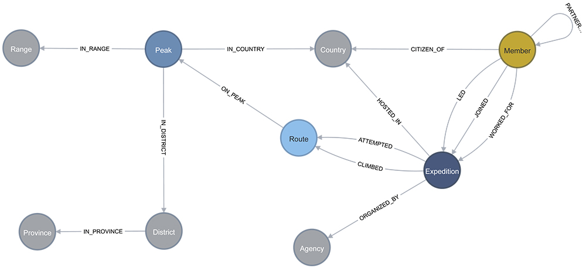

# Neo4j Graph Database Schema
The Neo4j database overall schema is defined as below:

Read the [detailed documentation about the graph model here](./NEO4J_DATABASE.md)

Unless stated otherwise, all nodes and relationships' properties are coming from the Himalayan Database. and their
definition below is copied from the [Himalayan Database Program Guide for Windows Himal 2.5](https://www.himalayandatabase.com/downloads.html)
documentation.

Also note that columns in the Himalayan Database represented by codes, e.g. `DEATHTYPE` with values like
* 0 – Unspecified
* 1 – AMS (acute mtn sickness)
* 2 - Exhaustion
* etc.

have been replaced by their full text value (e.g. `DEATHTYPE` value `0` has been replaced with `Unspecified`).
## Nodes
All nodes are created with a `name` property which can be used in graph display to identify the nodes.
### Range
- `name`: the name of the range (unique). As defined in the Nepal Himal Peak Profile website.
### Province
- `name`: the name of the province (unique). As defined in the Nepal Himal Peak Profile website.
### District
- `name`: the name of the district (unique). As defined in the Nepal Himal Peak Profile website.
### Peak
- `peakId`: the ID of the peak as defined in the Himalayan Database (unique).
- `name`: the name of the peak.
- `alternateNames`: the alternate names of the peak.
- `heightMeters`: the height of the peak in meters.
- `heightFeet`: the height of the peak in feet.
- `latitude`: the latitude of the peak from the Nepal Himal Peak Profile website.
- `longitude`: the longitude of the peak from the Nepal Himal Peak Profile website.
- `opened`: whether the peak is opened for climbing or not.
- `unlisted`: the peak is not on any Nepal government list of approved peaks and thus is not legally open for mountaineering.
- `trekking`: whether the peak is on the Nepal government’s approved list of trekking peaks.
- `hasBeenClimbed`: whether the peak has been climbed or not.
- `trekkingYearAddition`: the year that the peak was added to the Nepal government’s list of trekking peaks.
- `description`: the description of the peak.
- `memo`: miscellaneous peak information, including alternative summit heights given by other sources.
- `referenceMemo`: sources of general information about the peak (information for specific expeditions is given in the 
literature record for each expedition).
- `photoMemo`: sources of photographs for the peak.
- `nepaleseFees`: the fees to climb the peak for Nepalese citizens. As defined in the Nepal Himal Peak Profile website.
- `foreignerFees`: the fees to climb the peak for foreigners. As defined in the Nepal Himal Peak Profile website.
### Route
- `name`: the name of the route (unique). It is a combination of the route name and peak ID from the Himalayan Database
  (e.g. `name: S Face-S Spur (ANN2)`).
### Country
- `name`: the name of the country (unique).
### Agency
- `name`: the name of the agency (unique) of the Expedition.
### Expedition
- `expeditionId`: the expedition ID in the Himalayan Database (the unique key is a combination of `expeditionId` and `year`).
- `year`: the year fo the expedition.
- `name`: a combination of the expedition ID an the year (e.g. `name: ANN273101 1973`).
- `season`: the season of the expedition.
- `successClaimed`: the expedition’s claim of success has been disproved or is not generally recognized by the 
mountaineering community.
- `successDisputed`: the expedition’s claim of success is either unverified, has been disputed by another party (but 
the evidence is insufficient to not recognize the ascent), or is of a controversial style (such as using a helicopter 
during the ascent).
- `totalNbDays`: total number of days of the expedition.
- `terminationReason`: the reason for the expedition’s termination. Refer to the Himalayan Database Program Guide for
 Windows Himal 2.5 for the list of possible values.
- `highpoint`: the highest point reached by the expedition.
- `traverse`: whether the expedition traversed peaks.
- `ski`: whether the expedition used skis or snowboard during part of the descent of the peak by at least one member 
of the expedition.
- `parapente`: whether the expedition used parapente or hang-glider during part of the descent by at least one member 
of the expedition.
- `camps`: the list of camps used by the expedition.
- `nbMembers`: the number of members in the expedition.
- `nbMembersSummit`: the number of members who reached the summit.
- `nbMembersDeaths`: the number of members who died during the expedition.
- `nbHiredPersonnel`: the number of hired personnel in the expedition.
- `nbHiredPersonnelSummit`: the number of hired personnel who reached the summit.
- `nbHiredPersonnelDeaths`: the number of hired personnel who died during the expedition.
- `noHiredPersonnelAboveBasecamp`: whether there was no hired personel above base camp.
- `o2Used`: whether oxygen was used by at least one member of the expedition.
- `o2None`: whether oxygen was not used by any members of the expedition.
- `o2Climb`: whether oxygen was used for climbing by at least one member of the expedition.
- `o2Descent`: whether oxygen was not used for climbing, but was used only in descent on part of the route by at least 
one member of the expedition.
- `o2Sleep`: whether oxygen was used for sleeping by at least one member of the expedition.
- `o2Medical`: whether oxygen was used for medical purposes by at least one member of the expedition.
- `o2Taken`: whether oxygen was brought for emergency use, but was not used by any members of the expedition.
- `o2Unknown`: the use of oxygen is unknown for this expedition.
- `sponsor`: the sponsor of the expedition.
- `approach`: the approach used by the expedition. 
- `basecampDate`: the date of the expedition arrived at base camp.
- `summitDate`: the date the expedition reached the summit.
- `summitTime`: the time the expedition reached the summit. 
- `terminationDate`: the date of the expedition’s termination.
- `terminationNote`: the primary reason that the expedition was terminated. Refer to the Himalayan Database Program
 Guide for Windows Himal 2.5 for the list of possible values.
- `amountFixedRopes`: amount of fixed ropes used by the expedition (in meters).
- `otherSummits`: the other summits reached by the expedition.
- `campsite`: details about the camp sites.
- `routeMemo`: details about the route written by the expedition members.
- `accidents`: details about the accidents during the expedition.
- `achievements`: details about the achievements done by the expedition (e.g. "1st Indonesian on summit; 1st woman on summit").
- `standardRoute`: whether the expedition used the standard route.

As explained in the [detailed documentation about the graph model here](./NEO4J_DATABASE.md), commercial expeditions
are given an extra `CommercialExpedition` label and non-commercial expedition an extra `NonCommercialExpedition` label.
### Member
- `personId`: the unique ID of the person generated during the data ETL.
- `firstName`: the first name of the person.
- `lastName`: the last name of the person.
- `name`: the combination of the last name and first name.
- `gender`: the gender of the person.
- `yearOfBirth`: the year of birth of the person.
- `residence`: the residence of the person.
- `occupation`: the work of the person.

As explained in the [detailed documentation about the graph model here](./NEO4J_DATABASE.md), Sherpas are given an
extra `Sherpa` label, Tibetans an extra `Tibetan` label, and others a `NonSherpaNonTibetan` label.

Also, many of the columns in the `member` table in the Himalayan Database represent properties specific to the member in 
a specific expedition. These properties are thus represented as properties of the relationship between the
`Member` and `Expedition` nodes.
## Relationships
Are listed below only relationships that have properties or are not self-explanatory.
### CLIMBED and ATTEMPTED
In the Expedition table of the Himalayan Database, an expedition with a route with the corresponding success column set
to `true` is represented by a `CLIMBED` relationship, and an expedition with a route with the corresponding success
column set to `false` is represented by an `ATTEMPTED` relationship. The corresponding `ASCENT` column is represented as
a property of the relationship.
- `ascent`: the ascent number of the route for the expedition. The number has been stripped of the `st`, `nd`, `rd` or 
`th` suffix.
### PARTNERED_WITH
- `expeditionCount`: the number of expeditions that the two members have been on together.
### LED, JOINED, WORKED_FOR
- `memberId:`: the member ID of the person in the expedition.
- `status`: the status of the member in the expedition (e.g. `Climber`, `Exp Doctor`, `Film Team`, etc.).
- `deputy`: whether the member was the deputy of the expedition leader.
- `basecampOnly`: whether the member went only to base camp during that expedition.
- `notToBasecamp`: whether the member did reach base camp or not during that expedition.
- `highAltitudeSupportMember`: whether the member went above base camp only in a support role (e.g. used for photographer and avisors).
- `disabled`: whether the member is physically disabled.
- `summitSuccess`: whether the member reached the summit.
- `successClaimed`: whether the member’s claim of success has been disproved or is not generally recognized by the 
mountaineering community.
- `successDisputed`: whether the member’s claim of success is either unverified or has been disputed by another party,
but the evidence is insufficient to not recognize the ascent.
- `solo`: whether the member climbed the peak solo.
- `traverse`: whether the member traversed peaks.
- `ski`: whether the member used skis or a snowboard during part of the descent of the peak.
- `parapente`: the member used a parapente or hang glider during part of the descent of the peak.
- `o2Used`: whether oxygen was used by the member during the expedition.
- `o2None`: whether oxygen was not used by the member during the expedition.
- `o2Climb`: whether oxygen was used for climbing by the member during the expedition.
- `o2Descent`: whether oxygen was not used for climbing, but was used only in descent on part of the route by the member 
during the expedition.
- `o2Sleep`: whether oxygen was used for sleeping by the member during the expedition.
- `o2Medical`: whether oxygen was used for medical purposes by the member during the expedition.
- `death`: whether the member died during the expedition.
- `deathType`: the type of death of the member during the expedition.
- `deathClass`: the class of death of the member during the expedition.
- `deathAmsRelated`: whether the death was related to AMS.
- `deathWeatherRelated`: whether the death was related to weather.
- `injury`: whether the member was injured during the expedition.
- `injuryType`: the type of injury of the member during the expedition.
- `summitBid`: summit bid.
- `summitBidTerminationReason`: summit bid termination reason.
- `ageDuringExpedition`: the age of the member during the expedition.
- `speedAscent`: whether the member attempted a speed ascent.
- `expeditionHighPointReached`: whether the member reached the expedition’s high point during the expedition.
- `personalHightPointReached`: personal high point reached by the member during the expedition.
- `summitDate`: the date the member reached the summit.
- `summitTime`: the time the member reached the summit. 
- `o2UsageNote`: notes about the oxygen usage of the member during the expedition.
- `deathDate`: the date of the member’s death during the expedition.
- `deathTime`: the time of the member’s death during the expedition.
- `deathHeight`: the height at which the member died during the expedition.
- `deathNote`: notes about the member’s death during the expedition.
- `necrology`: the necrology of the member during the expedition.
- `injuryDate`: the date of the member’s injury during the expedition.
- `injuryTime`: the time of the member’s injury during the expedition.
- `injuryHeight`: the height at which the member was injured during the expedition.
- `memo`: additional notes.